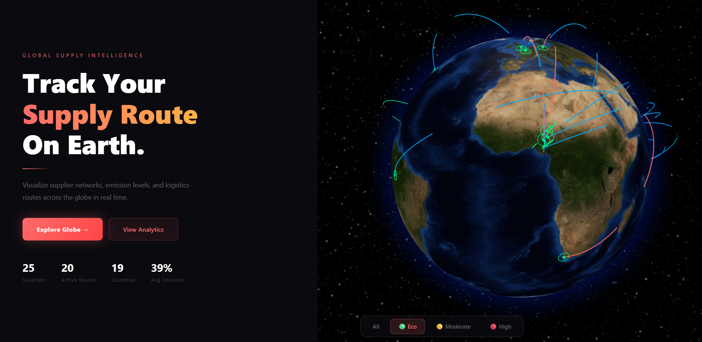

# 🌍 Eco-Sync: Global Supply Chain Visualization 🚀



Eco-Sync is an interactive web application designed to visualize global supply chains on a stunning 3D globe 🌐. It helps users explore and understand the environmental impact and sustainability of supply networks, making complex data accessible and engaging through maps, analytics, and real-time interactions 📊.

## 🛠️ Technologies Used

This project leverages a cutting-edge tech stack to deliver a smooth, performant, and visually appealing experience:

- **Frontend Framework:** React ⚛️ + Vite ⚡ for fast development and building
- **3D Rendering:** Three.js 🧊 with React Three Fiber and Drei for immersive 3D scenes
- **Globe Visualization:** React Globe GL 🌍 for interactive global maps
- **Styling:** TailwindCSS 🎨 for modern, responsive UI
- **Animations:** GSAP and Framer Motion ✨ for fluid transitions
- **Data Visualization:** D3 📈 and Recharts for charts and analytics
- **State Management:** Zustand 🗂️ for efficient app state
- **Routing:** React Router DOM 🛤️ for navigation
- **Post-Processing:** React Three Postprocessing for enhanced visuals
- **Development Tools:** ESLint 🧹 for code quality, Vite for bundling

## 🌟 Features

- **Interactive 3D Globe:** Explore supply chain nodes and connections worldwide 🗺️
- **Real-Time Analytics:** Dive into data with dynamic charts and filters 📉
- **Supply Chain Mapping:** Visualize nodes, routes, and environmental metrics 🌱
- **Responsive Design:** Works seamlessly on desktop and mobile devices 📱
- **Performance Optimized:** Fast loading with modern web technologies 🚀

## 🌱 Purpose

Eco-Sync empowers businesses and individuals to make informed decisions about supply chains by highlighting environmental footprints, promoting sustainable practices, and fostering transparency in global trade networks. It's a tool for education, analysis, and advocacy in the realm of eco-friendly supply management ♻️.

## 🚀 Getting Started

To get a local copy up and running, follow these simple steps.

### Prerequisites

Make sure you have Node.js and npm installed on your machine.

- [Node.js](https://nodejs.org/en/) (LTS version recommended)

### Installation & Running

1.  Clone the repo
    ```sh
    git clone https://github.com/noeljr2306/eco-sync.git
    ```
2.  Install NPM packages
    ```sh
    npm install
    ```
3.  Run the development server
    ```sh
    npm run dev
    ```
4.  Open [http://localhost:5173](http://localhost:5173) to view it in the browser 🌐

## 📝 Usage

- Navigate through different pages: Map View 🗺️, Analytics 📊, and more
- Interact with the globe to explore supply chain data
- Use filters to customize your view and gain insights

## 🤝 Contributing

Contributions are welcome! Please feel free to submit a Pull Request 🚀.

## 📄 License

This project is licensed under the MIT License - see the [LICENSE](LICENSE) file for details 📜.
`2.  Install NPM packages
   `sh
npm install
`3.  Run the development server
   `sh
npm run dev
```
Open the local server address shown in your terminal to view it in the browser.
